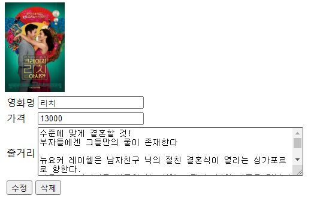
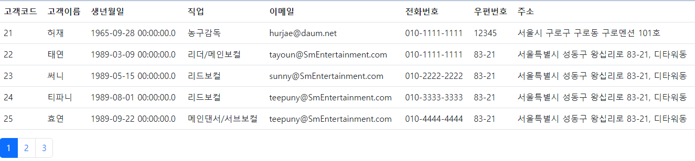
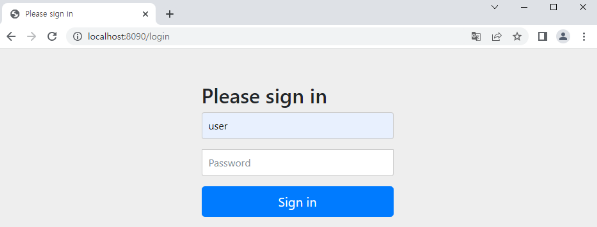
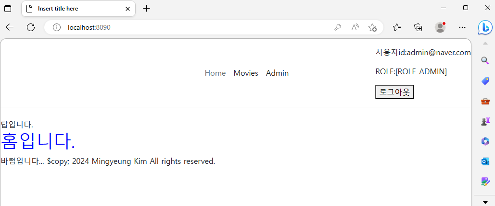
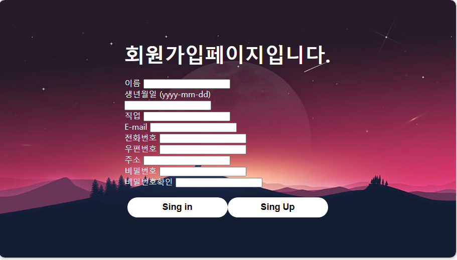

# JAVAOracle 학원 실습

<table>
  <tr><th>no</th><th>name</th><th>descript</th><th>date</th></tr>
  <tr><td>1</td><td>test1</td><td></td><td>23-04-03</td></tr>
  <tr><td>2</td><td>test2</td><td></td><td>23-04-04</td></tr>
  <tr><td>3</td><td>test3</td><td></td><td>23-04-05</td></tr>
  <tr><td>4</td><td>movie1</td><td>오라클DB사용해서 데이터생성후 DAO모델 실습</td><td>23-04-06</td></tr>
  <tr><td>5</td><td>movie2</td><td>모델2: 조회/등록/검색 기능추가하기</td><td>23-04-07</td><td></td></tr>
  <tr><td>6</td><td>movie2</td><td>모델2: 조회/등록/검색/수정/삭제 기능추가(완성)</td><td>23-04-10</td><td></td></tr>
  <tr><td>7</td><td>SprntDemo</td><td>spring:APO예제</td><td>23-04-10</td><td></td></tr>
  <tr col=3><td>8</td><td>Spring1</td><td>spring:text 출력 안녕하세요</td><td>23-04-11</td><td></td></tr>
  <tr><td></td><td>Spring2</td><td>spring:text 출력 CurrentTime</td><td>23-04-11</td><td></td></tr>
  <tr><td></td><td>Spring3</td><td>spring:jdbc연동: 조회</td><td>23-04-11</td><td></td></tr>
 <tr><td>9</td><td>tour</td><td>spring:DB매핑/부트스트링3;여행사</td><td>23-04-12</td><td></td></tr>
 <tr><td>10</td><td>boot4</td><td>spring:;여행사;조회기능/로그인(인코딩/권한)/페이징처리(thymeleaf:redirect/include)</td><td>23-04-12</td><td></td></tr>
 <tr><td>11</td><td>boot4</td><td>spring:;customers/movieDB통합,admin계정(thymeleaf:redirect/include)</td><td>23-04-12</td><td></td></tr>
  <tr><td>12</td><td>boot5</td><td>spring:;로그인(thymeleaf:redirect/include)</td><td>23-04-18</td><td></td></tr>
  <tr><td>12</td><td>boot5</td><td>spring:;회원가입(thymeleaf:redirect/include)</td><td>23-04-21</td><td></td></tr>
 

